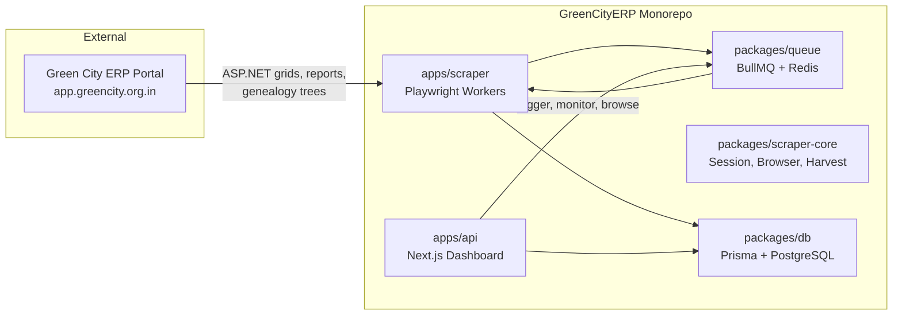

# GreenCityERP — Comprehensive Project Overview

**GreenCityERP** (package name: `greencity-erp`) is an **ERP data sync / scraper platform**. It does not build ERP software itself — instead, it automatically extracts business data from the existing **ASP.NET WebForms ERP portal** at [Green City Muzaffarpur](http://app.greencity.org.in) and stores it in a local **PostgreSQL** database.

Dashboard title: **"Green City ERP Sync"** — *"ERP data extraction dashboard"*



---

## Purpose and Main Goals

### Primary Purpose

Provide an automated pipeline to bring fragmented, browser-only data from the external ERP portal into a **centralized, queryable, exportable** format.

### Core Objectives

1. Scrape **~90 admin modules** — sales, accounting, banking, land/plots, BP management, payouts, master data
2. Harvest **BP (Business Partner) genealogy trees** — sponsor and binary MLM network structure
3. **Reliable ingestion** — deduplication (`rowHash`), run tracking, failure snapshots, backfill support
4. **Operational control** — trigger scrapes, pause/resume, live monitoring, CSV export from the dashboard
5. **Performance optimization** — HTTP turbo mode for genealogy, browser pooling, high concurrency (ongoing work documented in [`docs/`](docs/))

### What Problem It Solves

- Manually browsing 80+ portal modules is slow and error-prone
- BP network trees (sponsor + binary legs) require complex DOM interactions
- Analytics, reporting, and downstream systems need a **local mirror** of ERP data
- Operations teams need to schedule, retry, and audit scrape runs

---

## Important Background Context

### What "Green City" Means

**This is not municipal waste management or smart-city sustainability ERP.** "Green City" here refers to **Green City Muzaffarpur** — a **real-estate / land development** company whose business model includes:

- Plot sales and bookings
- Raw land acquisition and registry
- **Business Partners (BP)** — MLM-style distributor network
- Commissions, NEFT payouts, reward EMI
- E-PIN based BP joining
- Site visits, expenses, banking, accounting

### Relationship to Source ERP

| Aspect | Detail |
|--------|--------|
| Source | `http://app.greencity.org.in` (ASP.NET WebForms) |
| Auth | `ADMIN_USERNAME/PASSWORD`, `BP_USERNAME/PASSWORD` via env |
| Scraping | Primarily **Playwright 1.52** (Chromium); optional HTTP harvest for genealogy |
| Data format | Raw JSON rows in `RawModuleRow.rowJson` — not a normalized business schema |

### Project Maturity

- Active development with performance optimization focus
- **Wave 1 pilot modules** validated first: `master_bank`, `bp_list`, `sale_list`, `accounting_transactions`, `neft_list` ([`packages/shared/src/modules/admin-registry.ts`](packages/shared/src/modules/admin-registry.ts))
- `bp_list` alone has up to **~1769 pages** of paginated grid data
- Additional documentation lives in [`docs/`](docs/)

---

## Monorepo Structure

| Path | Role |
|------|------|
| [`apps/api/`](apps/api/) | Next.js 15 dashboard + REST API (port **3010**) |
| [`apps/scraper/`](apps/scraper/) | Playwright workers, orchestrators, CLI tools |
| [`packages/db/`](packages/db/) | Prisma ORM, PostgreSQL schema, migrations, upsert logic |
| [`packages/queue/`](packages/queue/) | BullMQ job queues on Redis |
| [`packages/scraper-core/`](packages/scraper-core/) | Shared engine: sessions, browser pool, navigation, BP harvest |
| [`packages/shared/`](packages/shared/) | Module registry, DOM selectors, WebForms helpers, config |
| [`docs/`](docs/) | Architecture audits, optimization results, implementation phases |
| [`scripts/`](scripts/) | Shell automation (genealogy gate, trigger remaining, dist verify) |
| [`data/exports/`](data/exports/) | Exported data (e.g. genealogy CSV) |

**Tooling:** pnpm 10.28.2 workspaces + Turborepo 2.x, Node.js ≥ 20, TypeScript 5.8

---

## Tech Stack

| Layer | Technology |
|-------|------------|
| Language | TypeScript (ES modules) |
| Frontend/API | Next.js 15, React 19 |
| Scraping | Playwright (Chromium), optional `undici` HTTP harvest |
| Job queue | BullMQ 5.x + ioredis |
| Database | PostgreSQL 15 (schemas: `ingest`, `system`) |
| ORM | Prisma 6.8 |
| Logging | pino |
| Excel parsing | xlsx (portal exports) |
| Deployment | Docker Compose (multi-stage Dockerfiles) |

---

## Architecture and Data Flow

### Three BullMQ Queues

| Queue | Purpose |
|-------|---------|
| `greencity-module-scrape` | Admin module grid/report scraping |
| `greencity-genealogy-scrape` | Per-BP sponsor + binary tree harvesting |
| `greencity-bp-harvest` | Combined BP profile + genealogy (when `BP_HARVEST_QUEUE=true`) |

### Scrape Pipeline (Admin Modules)

1. Job enqueued from dashboard or cron
2. Worker logs in via Playwright (admin credentials)
3. Navigate to portal page via module registry `navPath` / `directUrl`
4. Handle ASP.NET WebForms pagination (`__VIEWSTATE`, `__EVENTTARGET` postbacks)
5. Extract grid rows using DOM selectors ([`packages/shared/src/selectors/generated/`](packages/shared/src/selectors/generated/))
6. Upsert JSON into `RawModuleRow` with `rowHash` deduplication
7. Update `ScrapeRun` status (pending → running → completed/failed/partial)

### Genealogy Pipeline (BP Network)

1. BP codes sourced from `bp_list`
2. Per-BP jobs: admin panel impersonation or direct BP login
3. Parse sponsor tree + binary (left/right legs) orgchart DOM
4. Store in `GenealogyNode` + `GenealogyEdge` tables
5. Turbo mode: admin cookie + HTTP HTML harvest (~8–12 BP/min per slot documented)

### Scheduling

- Hourly cron tick (02:00–05:00 window) enqueues scheduled modules
- `ModuleSchedule` table in `system` schema with cron expressions per module

---

## Database Model

Defined in [`packages/db/prisma/schema.prisma`](packages/db/prisma/schema.prisma).

Infrastructure-focused models — **business entities are not normalized tables**; they live as JSON blobs:

| Model | Purpose |
|-------|---------|
| `ScrapeRun` | Per-job status, row counts, errors, metadata |
| `RawModuleRow` | Scraped business data as `rowJson` + unique `rowHash` |
| `GenealogyNode` | BP tree nodes (sponsor/binary) with modal data |
| `GenealogyEdge` | Parent-child relationships with leg (left/right/sponsor) |
| `BpSession` | Playwright storage state per BP for session reuse |
| `ScrapeFailure` | Failed pages with HTML snapshot paths |
| `BackfillProgress` | Historical date-range backfill tracking |
| `ModuleSchedule` | Cron schedules per module |

**Enums:** `Portal` (admin/bp), `ScrapeRunStatus`, `GenealogyTreeType` (sponsor/binary), `GenealogyLeg`

---

## Business Domains Scraped (~90 Modules)

Defined in [`packages/shared/src/modules/admin-registry.ts`](packages/shared/src/modules/admin-registry.ts):

| Domain | Examples |
|--------|----------|
| **Master Data** | Bank, project, branch, accounting head, project phase |
| **Raw Management** | Raw land, plot list, registered plots, registry, brokers, owners, payments |
| **Sale Operation** | Sale list, new sale, hold for sale, sale transactions, attachments |
| **BP Management** | BP list, new BP, income summary, sale performance, awards |
| **BP Payout** | NEFT list, payout balance sheet, reward EMI, downline income |
| **Accounts Operation** | Accounting transactions, investor, land/office expense, loan & advances |
| **Accounts Reports** | Daily/monthly/yearly reports, transactions sheet |
| **Banking** | Cash ledger, bank-to-bank, sale/accounting cheques |
| **Joining Pin** | E-PIN list, PIN generator/transfer |
| **Administrator** | Users, control groups, company (scraped config, not local RBAC) |
| **Finder & Editor** | Accounting entity, sales transactions |

---

## Dashboard and API Surface

### Frontend Pages

| Route | Function |
|-------|----------|
| `/` | Overview — run counts, row counts, failures, recent runs |
| `/live` | Live scrape monitoring |
| `/data` | All scraped modules grid |
| `/data/[moduleKey]` | Per-module data browser |
| `/data/genealogy` | Genealogy nodes/edges viewer |
| `/modules` | Module list — trigger scrape, export, status |
| `/runs` | Scrape run history |
| `/backfill` | Backfill progress and controls |

### Key API Routes

- `POST /api/runs/trigger` — single module
- `POST /api/runs/trigger-all` — all modules bulk
- `POST /api/runs/trigger-sequential` — ordered scrape (BP List first)
- `POST /api/runs/trigger-remaining` — remaining modules after genealogy
- `POST /api/runs/trigger-genealogy` — full genealogy batch
- `GET/POST /api/scrape/control` — pause/resume/stop
- `POST /api/backfill/start` — historical backfill
- `GET /api/genealogy/export` — CSV export
- `GET /api/worker/status` — worker heartbeat

### Auth Note

`DASHBOARD_PASSWORD` is defined in [`.env.example`](.env.example) but **dashboard auth does not appear to be enforced in code** — network-level protection may be expected in production.

---

## Getting Started

### Prerequisites

- Node.js ≥ 20
- pnpm 10.28.2
- PostgreSQL 15 and Redis 7 (or use Docker Compose)

### Local Development

```bash
pnpm install
pnpm bootstrap          # prisma generate + turbo build
pnpm dev                # api + scraper in watch mode
pnpm dev:api            # Next.js dashboard on :3010
pnpm dev:scraper        # scraper worker only
```

### Database

```bash
pnpm db:generate        # generate Prisma client
pnpm db:migrate         # run migrations (dev)
pnpm db:deploy          # deploy migrations (prod)
pnpm db:push            # push schema without migration
```

### Docker (Production)

```bash
cp .env.example .env    # fill in credentials
pnpm docker:up          # docker compose up -d
```

| Service | Port | Role |
|---------|------|------|
| `postgres` | 5435→5432 | PostgreSQL 15 |
| `redis` | 6380→6379 | Redis 7 |
| `scraper` | — | Admin module worker (concurrency 3) |
| `genealogy-scraper` | — | Dedicated genealogy worker (concurrency 8, HTTP turbo) |
| `api` | 3010 | Next.js dashboard |

### Operational Scripts

- `scripts/genealogy-gate-loop.sh` — genealogy completion gate with retries
- `scripts/trigger-remaining.sh` — POST trigger-remaining after genealogy
- `scripts/admin-module-gate.sh` — admin module validation gate
- `scripts/verify-genealogy-dist.mjs` — source vs dist drift check

---

## Configuration

Copy [`.env.example`](.env.example) to `.env` and configure:

| Category | Variables |
|----------|-----------|
| Infra | `DATABASE_URL`, `REDIS_URL`, `PORT` |
| Portal auth | `ADMIN_USERNAME/PASSWORD`, `BP_USERNAME/PASSWORD`, `ERP_BASE_URL` |
| Scraper tuning | `SCRAPER_CONCURRENCY`, `SCRAPER_DELAY_MS`, `PLAYWRIGHT_HEADLESS` |
| Genealogy tuning | `GENEALOGY_CONCURRENCY`, `GENEALOGY_AUTH_MODE`, `GENEALOGY_HTTP_*` |
| Feature flags | `BP_HARVEST_QUEUE`, `SCRAPER_BROWSER_POOL`, `GENEALOGY_ENABLED` |
| Storage | `STORAGE_STATE_DIR`, `FAILURE_HTML_DIR` |

Central config loader: [`packages/shared/src/config.ts`](packages/shared/src/config.ts)

---

## Documentation

| File | Content |
|------|---------|
| [`docs/greencity-scraper-status.md`](docs/greencity-scraper-status.md) | Full architecture audit: Playwright vs HTTP, queues, auth, bottlenecks |
| [`docs/bp-harvest-platform-implementation.md`](docs/bp-harvest-platform-implementation.md) | Phases 0–10: browser pool, auth modes, harvest queue, HTTP prototype |
| [`docs/greencity-genealogy-optimization-results.md`](docs/greencity-genealogy-optimization-results.md) | Genealogy speed optimization benchmarks |
| [`docs/phase-0-reconcile-report.md`](docs/phase-0-reconcile-report.md) | Source vs dist reconciliation |

---

## Current State and Known Limitations

1. **Data model is ingest-first** — downstream consumers must parse JSON; no normalized ERP schema
2. **Playwright-dependent** — ASP.NET WebForms postbacks and orgchart DOM scraping require browser automation
3. **HTTP harvest is prototype** — genealogy turbo mode partially implemented; production mostly Playwright + admin panel cookies
4. **No in-app RBAC** — dashboard is effectively open unless externally protected
5. **Large scrape surface** — `bp_list` alone ~1769 pages; full sync is a long-running operation
6. **Optimization ongoing** — docs reference targets for improving from ~20 records/min toward much higher throughput

---

## Summary

**GreenCityERP = automated mirror of Green City Muzaffarpur's real-estate + MLM BP ERP portal**, built as a TypeScript monorepo with Playwright scrapers, BullMQ job orchestration, PostgreSQL ingest storage, and a Next.js operations dashboard — **not** a replacement ERP or municipal/green-city platform.

---

## Integration API (MLM ERP)

GreenCityERP exposes a versioned REST API for external MLM ERP systems to consume scraped data without direct database access.

- **Base path:** `/api/integration/v1`
- **Auth:** `x-api-key` header (`INTEGRATION_API_KEY` env var)
- **Swagger UI:** `/api/docs`
- **Consumer guide:** [`docs/EXTERNAL_APP_INTEGRATION.md`](docs/EXTERNAL_APP_INTEGRATION.md)
- **New endpoints (June 2026):** [`docs/INTEGRATION_API_NEW_ENDPOINTS.md`](docs/INTEGRATION_API_NEW_ENDPOINTS.md)

Endpoints: BPs, genealogy, sales, payments, projects — all with pagination and `updatedAfter` delta sync support.
